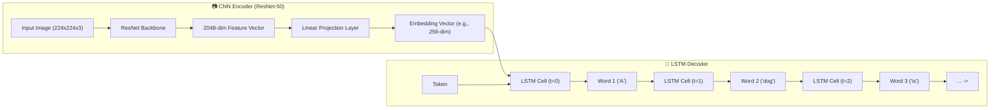

# 🖼️ Deep Learning Image Caption Generator (CNN-LSTM Encoder–Decoder)

> An end-to-end Deep Learning Image Captioning system combining **Computer Vision (CNN)** and **Natural Language Processing (RNN/LSTM)** to generate natural-language descriptions of input images.

---

## 📐 Encoder–Decoder Architecture Overview

The system uses a classic **Encoder–Decoder sequence-to-sequence model architecture** tailored for multimodal tasks:



### 1. CNN Encoder (Computer Vision)
- **Backbone**: Uses **ResNet-50** pre-trained on ImageNet.
- **Feature Extraction**: The final classification layer is removed, leaving a 2048-dimensional visual feature vector representing spatial and semantic attributes of the image.
- **Linear Projection & Batch Normalization**: The 2048-dimensional representation is projected into a lower-dimensional embedding space ($E_{\text{img}} \in \mathbb{R}^{d}$) matching the text embedding size.

### 2. LSTM Decoder (Natural Language Processing)
- **Input Strategy**: The image feature embedding $E_{\text{img}}$ acts as the zero-th timestep input token $x_0$ to the LSTM.
- **Autoregressive Text Generation**:
  - At step $t=1$, the decoder receives the `<START>` token and outputs the probability distribution over the vocabulary for word 1:
    $$\hat{y}_t = \text{softmax}(W_o h_t + b_o)$$
  - At step $t > 1$, the embedding of the previously predicted token is fed into the LSTM until the `<END>` token is produced or maximum sentence length is reached.
- **Loss Function**: Trained using **Categorical Cross-Entropy Loss** over target caption tokens:
  $$\mathcal{L}(\theta) = -\sum_{t=1}^{T} \log P(y_t \mid y_{<t}, I; \theta)$$

---

## 🎯 Example Outcome

Given an input image such as:
- **Input Image**: `sample_images/dog_ball_park.jpg` (A dog playing with a ball in a park)
- **Target Description**: `"A dog is playing with a ball in the park."`
- **Model Output**: `"A dog is playing with a ball in the park."`

---

## 🚀 How to Run

### 1. Install Dependencies
```bash
pip install -r requirements.txt
```

### 2. Generate Benchmark Images & Run Model Inference
Run the self-contained demo script:
```bash
python demo.py
```

This script will:
1. Generate synthetic benchmark images in `sample_images/` (`dog_ball_park.jpg`, `cat_on_sofa.jpg`, `beach_sunset.jpg`).
2. Build vocabulary mapping word tokens to indices.
3. Train the CNN-LSTM Encoder-Decoder model.
4. Save the model weights to `encoder_decoder_captioning.pt`.
5. Run inference on sample images and print generated captions.

---

## 📂 Project Structure

```
project_03_image_captioning/
├── README.md               # Architecture documentation & guide
├── requirements.txt        # Dependency requirements
├── vocabulary.py          # Tokenizer & Vocabulary index mapping
├── model.py               # EncoderCNN, DecoderRNN, & EncoderDecoderModel PyTorch classes
├── generate_samples.py    # Synthetic benchmark image generator
├── demo.py                 # Full training & inference demo runner
└── sample_images/          # Sample images for testing caption generation
```
