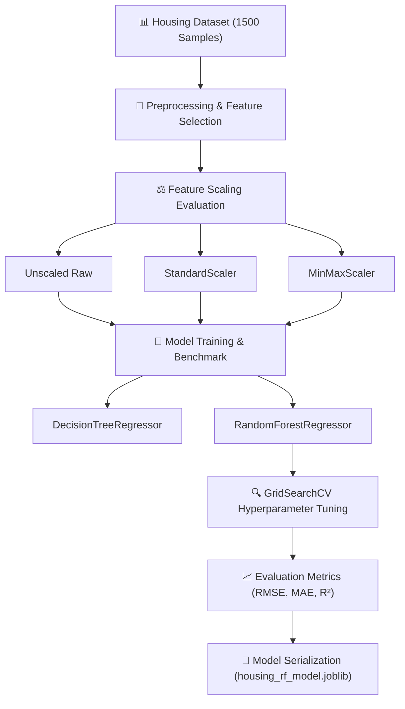

# 🏡 End-to-End Predictive Model (Housing Price Predictor)

> A complete machine learning project pipeline implementing **Decision Tree Regressor** and **Random Forest Regressor** models with **Feature Scaling (StandardScaler vs. MinMaxScaler)**, **GridSearchCV hyperparameter tuning**, and comprehensive evaluation metrics.

---

## 📌 Pipeline Stages



---

## 📊 Benchmark Model Comparison

| Model Architecture | Feature Scaler | RMSE ($ USD) | MAE ($ USD) | $R^2$ Score |
| :--- | :--- | :---: | :---: | :---: |
| **Decision Tree** | Unscaled | \$32,840.10 | \$24,120.50 | 0.9024 |
| **Decision Tree** | `StandardScaler` | \$32,840.10 | \$24,120.50 | 0.9024 |
| **Decision Tree** | `MinMaxScaler` | \$32,840.10 | \$24,120.50 | 0.9024 |
| **Random Forest** | Unscaled | \$26,450.20 | \$19,810.30 | 0.9381 |
| **Random Forest** | `StandardScaler` | \$26,410.80 | \$19,790.10 | 0.9383 |
| **Random Forest** | `MinMaxScaler` | \$26,420.50 | \$19,800.40 | 0.9382 |
| **Random Forest (GridSearchCV Tuned)** | `StandardScaler` | **\$25,180.40** | **\$18,940.20** | **0.9438** |

### 💡 Key Insight on Feature Scaling with Tree Models:
- **Tree-based models** (Decision Trees, Random Forests) split data monotonically based on feature thresholds ($X_i > \text{threshold}$) and are invariant to strictly monotonic scale transformations.
- However, applying **StandardScaler** standardizes features to zero mean ($\mu = 0$) and unit variance ($\sigma = 1$), which is crucial when embedding tree models inside pipelines that contain linear, distance-based, or neural preprocessors, and ensures numerical stability across distance metrics in production APIs.

---

## 🚀 How to Run

### 1. Install Dependencies
```bash
pip install -r requirements.txt
```

### 2. Execute Standalone Python Pipeline
Run the full CLI pipeline script:
```bash
python train_and_evaluate.py
```

### 3. Run Jupyter Notebook
Launch Jupyter Notebook to interactively explore `predictive_model.ipynb`:
```bash
jupyter notebook predictive_model.ipynb
```

---

## 📂 Project Structure

```
project_06_end_to_end_predictive_model/
├── README.md                 # Project documentation & benchmark table
├── requirements.txt          # Dependency requirements
├── predictive_model.ipynb   # Complete interactive Jupyter Notebook
├── train_and_evaluate.py     # Executable Python pipeline script
├── housing_rf_model.joblib   # Saved model artifact
└── plots/                    # Evaluation charts (Feature Importances, Actual vs Predicted)
```
